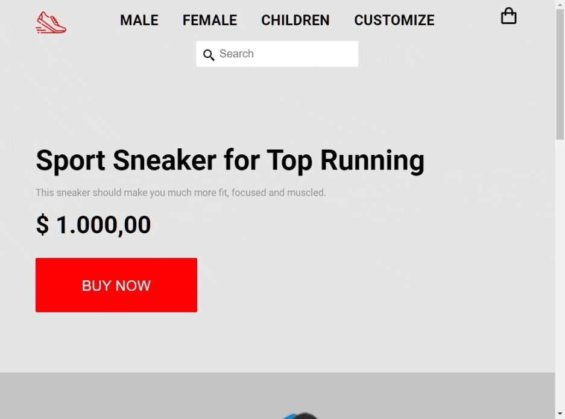
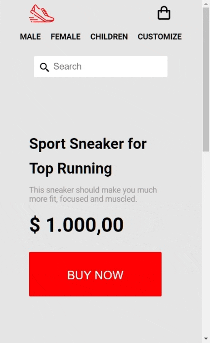

# frontend-rocketshoes
<h2>Challenge frontend design for RocketShoes</h2>

<h2>Responsive Page</h2>

<strong>:hammer_and_wrench: Project:</strong> Convert figma Layout to Frontend code . Using:

<ul>
  <li> HTML</li>
  <li> CSS</li>
  <li> Sass SCSS</li>
  <li> Media Queries</li>
  <li> Flexbox</li>
  <li> Grid</li>
  <!-- <li> Javascript</li> -->
</ul>

In this challenge, the task was to convert the Layout from Figma to HTML and CSS code.

I wrote from scratch all Html and, CSS (without any video reference).

In CSS, along with Sass, I'm using colors variables, viewport breakpoints, REM sizes, CSS reset, media queries, flexbox and grid.

<strong>Plus:</strong> added Sass to the project, to help me on some css settings. There was only 1 layout in Figma for Desktop size, but I decided to create the mobile compositions on my own. I also added some hover states that were not indicated in figma either.

<h2>Example Images</h2>

Desktop 

Tablet 

Mobile 

